# Movies & TV Show Preview app :octocat:

Demo Video:

---
## Table of contents
* [Introduction](#introduction)
* [User Interaction](#user-interaction)
* [Created with](#created-with)
* [Screen Shots](#screen-shots)

---
## Introduction
This app shows leates upcoming, trending Movies and TV Shows.
View details, favorites and watch list of the Movie or TV Show.
Add Movie or TV Show to favorites and Watch list and Rate them.
Search and Filter Movies or TV Shows.
Infinite Scrolling.
Check for Internet Connection and show alert if not connected.
App linked with the browser/hyperLink to redirct to the app.

> This app is a result of me finishing [iOS Networking With Swift](https://www.udacity.com/course/ios-networking-with-swift--ud421) Course.
>> I was trying to simulate [Merlan Serkaliyev](https://lnkd.in/dGychhTB) design for learning purposes only.
>> I used Figma to create app logo and icons like the Design.

---
## User Interaction 
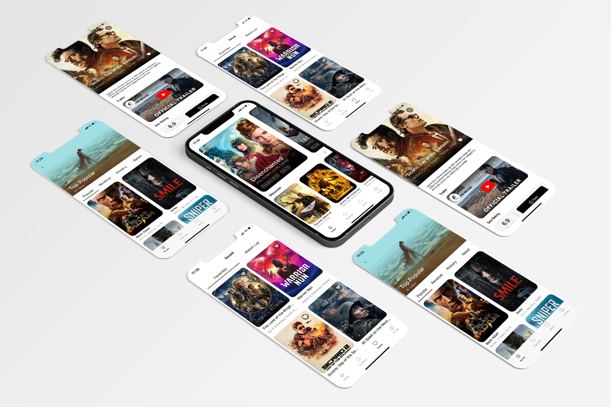

- Home page 
    - See Trending and Discover Movies/TV Shows 
    - Discover page
        - Top (Popular, Revenue, Primary, Rated) Movies
- Catalog page
    - Filter page
        - Filters Movies/TV Shows
        - Filter by most Popular, Newest, and Rated
        - Filter by Genre
        - Filter by Rating value
        - Filter by Release Date
        - Rest button to rest filters
    - Search for Movies/TV Shows
    - Infinite Scrolling
- Saved page
    - See his the Favorite Movies/TV Shows
    - See his Watch list Movies/TV Shows
- Profile Page
    - See his username
    - Login via the App
    - Loagin via the Website and redirect to the app
    - Signup via the Website
- Show Details page
    - See a preview of the Movie/TV Show
    - See trailer of the Movie/TV Show from Youtube
    - See the Cast of the Movie/TV Show
    - See Similar Movie/TV Show
    - Add Movie/TV Show to Favorits
    - Add Movie/TV Show to Watch List
    - Rate Movie/TV Show
    - Share a link to the Movie/TV Show

---
## Created with
- Apperance
    - Custom Font
    - Custom Gradient Layer using CAGradientLayer
    - Tab Bar
    - Navigation Controller
    - Custom CollectionView Cell
    - Custom Collection View Footer
    - Custom TableView Cell
    - Custom TableView Header and Footer
    - [Custom Paging CollectionView](https://github.com/Mohamed-Khaterr/PagingCollectionView-Swift) for multiple Collection Views
    - [Custom Segment Control](https://github.com/Mohamed-Khaterr/CustomSegmentControl-Swift) Connected with Paging Collection View
    - WebKit
    - UIActivityViewController

- Technologies  
    - [TheMovieDatabase](https://www.themoviedb.org/settings/api) API
    - URL Session dataTask with URL & URLRequest
    - Encodable & Decodable
    - Singleton Design Pattern
    - Delegate Desgin Pattern
    - GCD Dispatch Group
    - NSCache for caching images
    - userDefaults
    - Custom [URL Scheme & Universal Link](https://benoitpasquier.com/deep-linking-url-scheme-ios/) to Redirct to the app
    - Checking for Internet Connection using NWPathMonitor
    - **Dealing with Pagination in Cataloge Page**
    - **Try to reduce memory leaks**
    - **Test on bad internet connection**

---
## Screen Shots
### **Storyboard**

    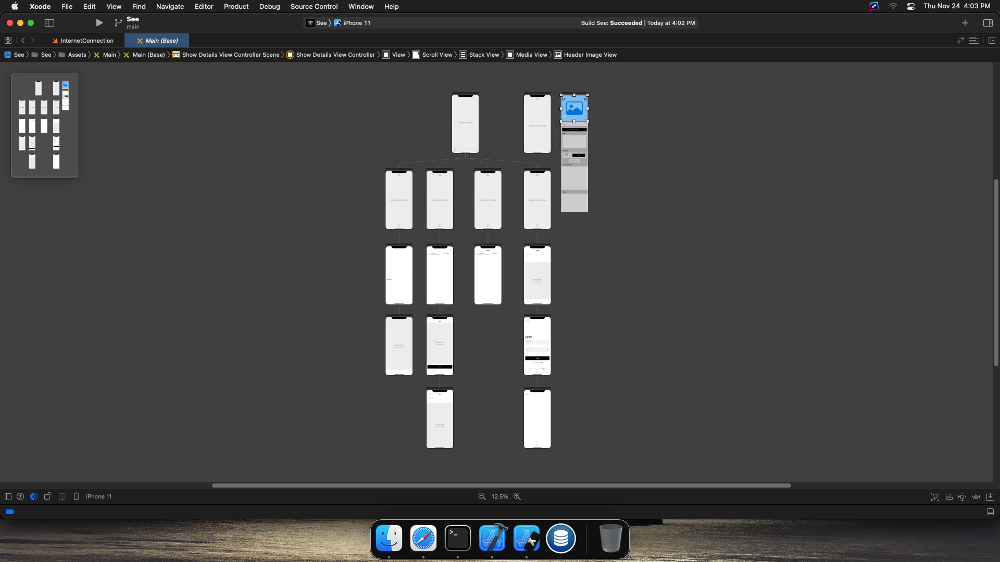

### **Light Mode**

    
    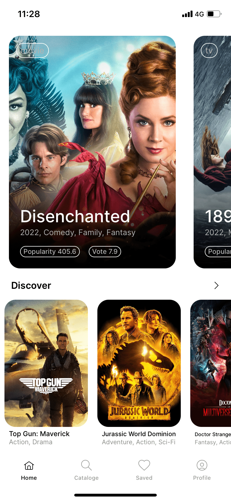
    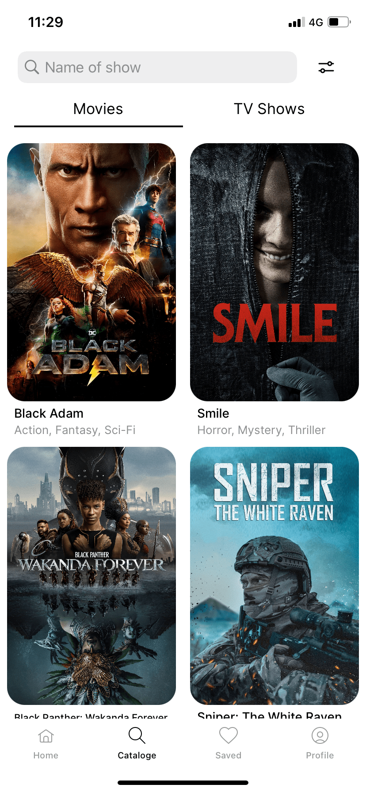
    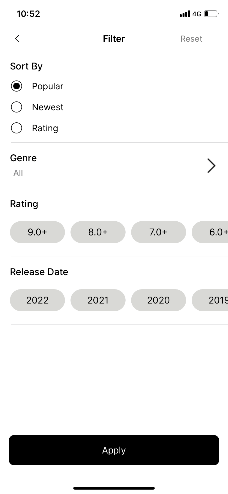
    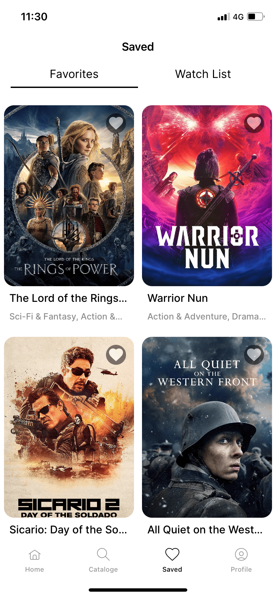
    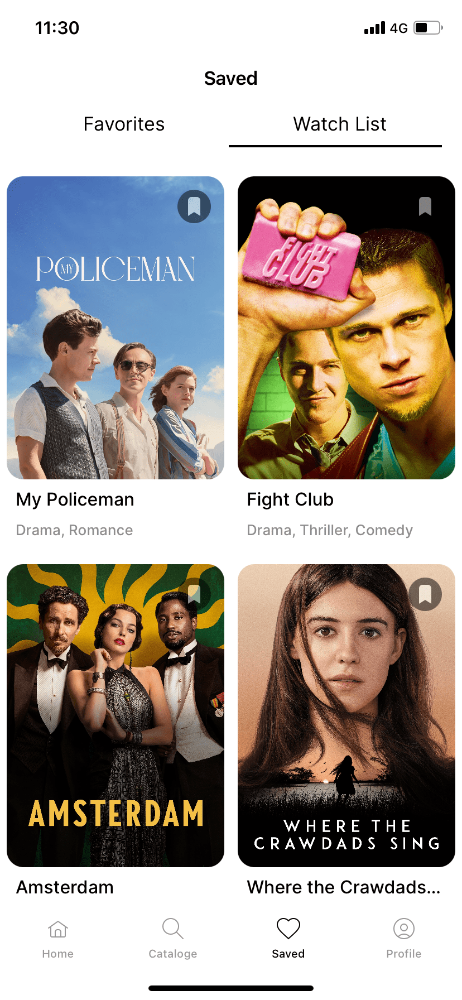
    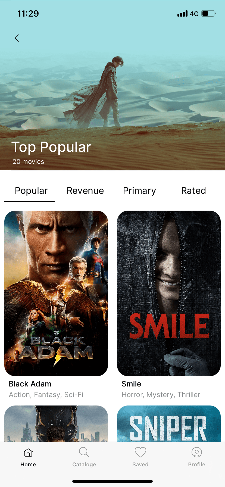
    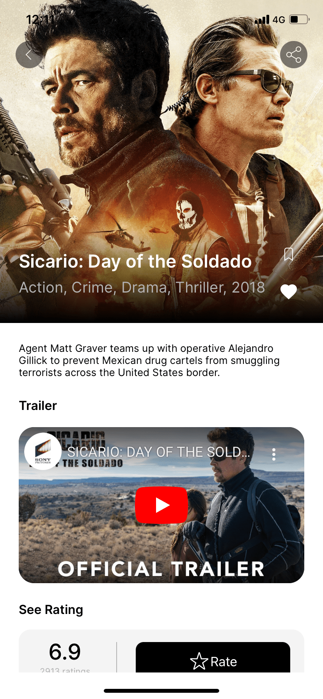
    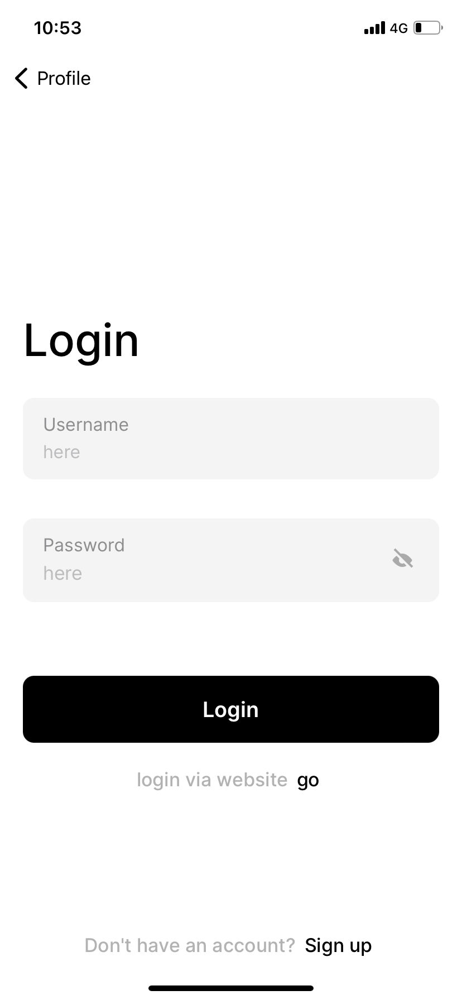

---

### **Dark Mode**

    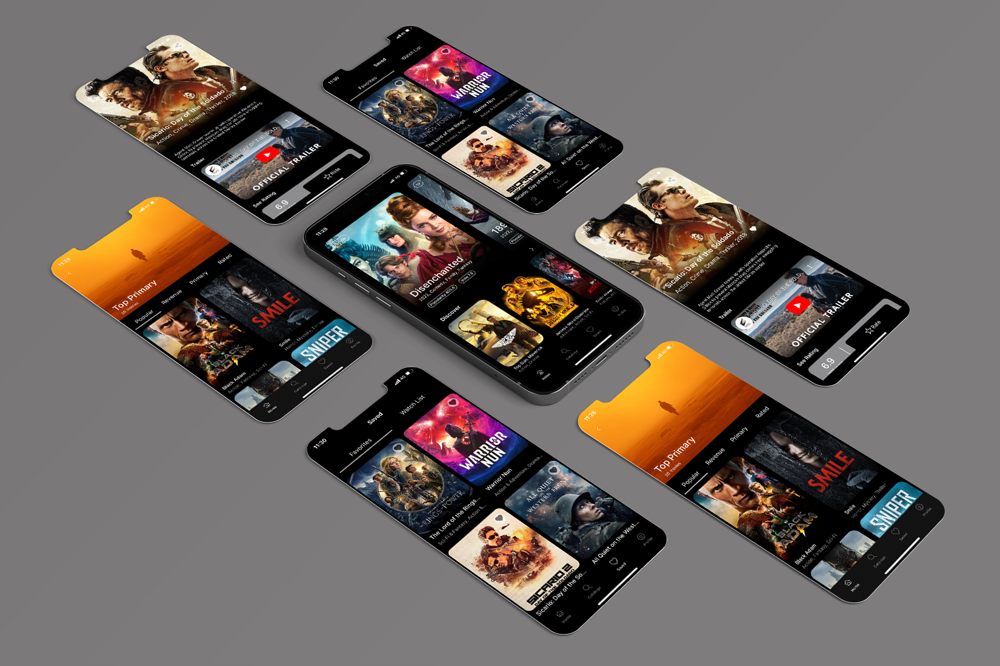
    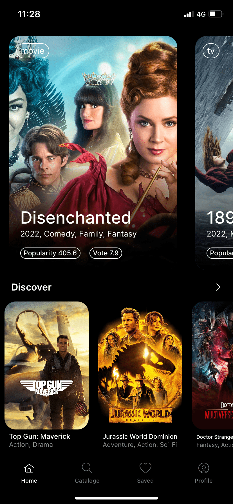
    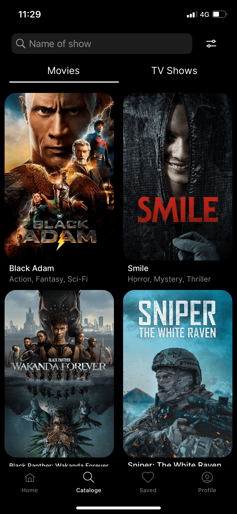
    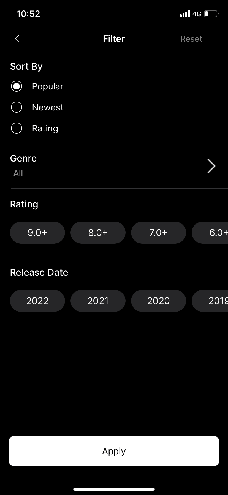
    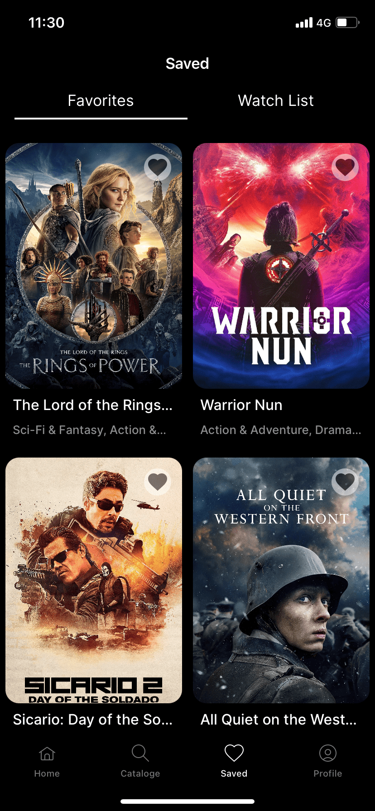
    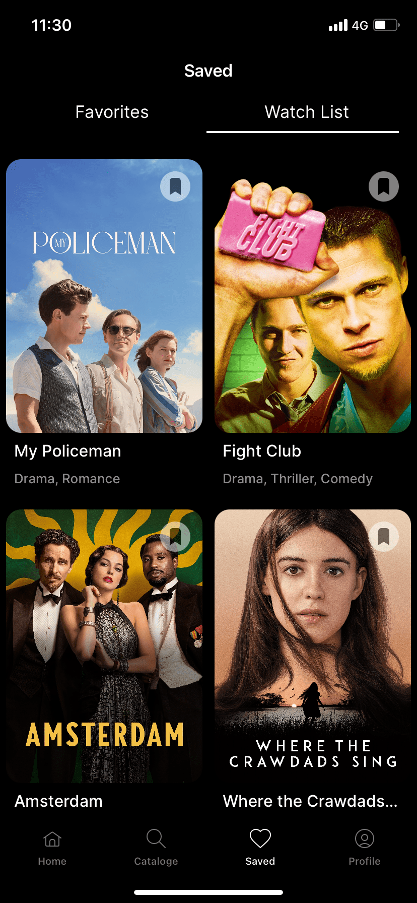
    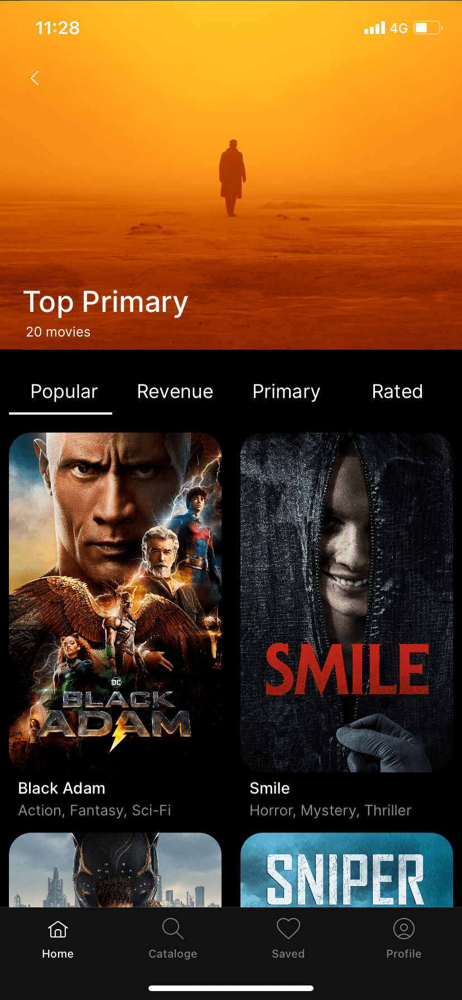
    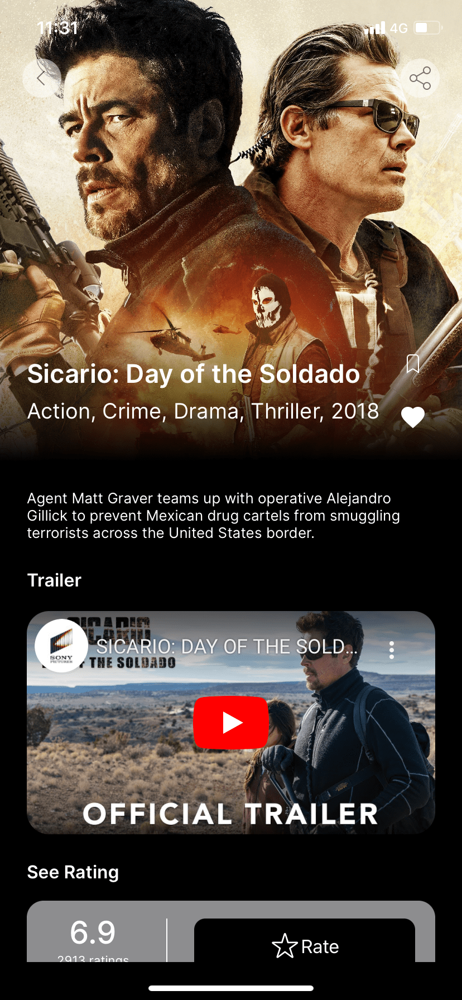
    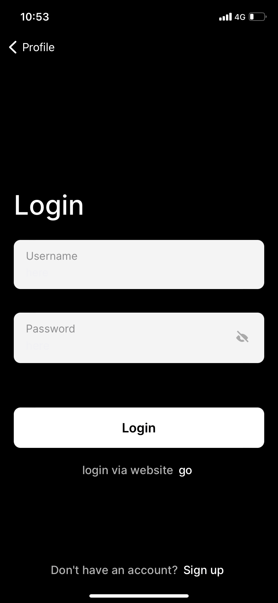

